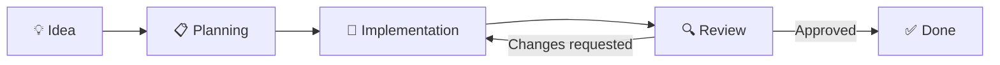
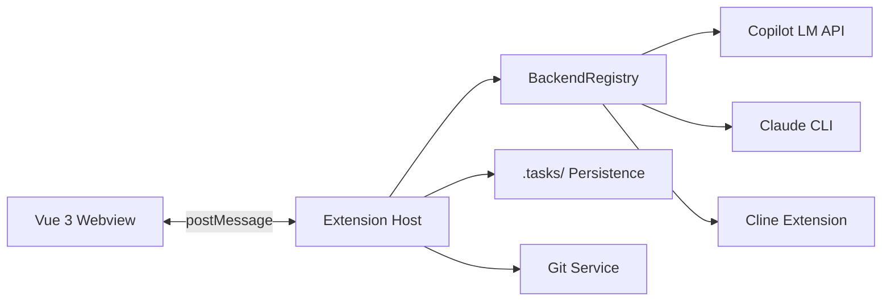

<p align="center">
  
</p>

<h1 align="center">Agent Board</h1>

<p align="center">
  <strong>AI-powered kanban board for VS Code — autonomous agent workflows from idea to merged code.</strong>
</p>


<p align="center">
  <a href="https://github.com/stefanposs/agent-board/actions"></a>
  <a href="https://github.com/stefanposs/agent-board/blob/main/LICENSE"></a>
  
  
</p>

---

## What is Agent Board?

Agent Board is a VS Code extension that provides a **visual kanban board** where AI agents autonomously plan, implement, review, and merge code changes. Tasks flow through configurable stages — from initial idea to merged code — with AI agents handling the heavy lifting at each step.



## Features

- **🎯 Visual Kanban Board** — Drag-and-drop task management inside VS Code
- **🤖 Multi-Backend AI** — GitHub Copilot, Claude CLI, or Cline — use whatever fits your workflow
- **🔄 Autonomous Workflow** — Agents move tasks through stages automatically
- **👥 Multi-Agent Architecture** — Planner, Developer, and Reviewer agents collaborate on every task
- **📝 Persistent State** — Tasks stored as Markdown files with YAML frontmatter in `.tasks/`
- **⚙️ Configurable Workflow** — Define stages, transitions, and agent behavior via `board.yaml`
- **🔁 Feedback Loops** — Reviewer agents send tasks back with specific feedback; developers iterate automatically
- **🔍 Decision Parsing** — Agents produce structured decisions (approve, request changes, needs clarification)

## Quick Start

### Install from VSIX

```bash
# Clone and build
git clone https://github.com/stefanposs/agent-board.git
cd agent-board
npm install
npm run package

# Install the extension
code --install-extension agent-board-0.1.0.vsix
```

### Open the Board

1. Click the **Agent Board** icon in the VS Code Activity Bar
2. Or run `Agent Board: Open Agent Board` from the Command Palette (`Cmd+Shift+P`)

### Configure a Backend

Add workspace paths and choose your AI backend in the settings:

```jsonc
// .vscode/settings.json
{
  "agentBoard.workspacePaths": ["~/Repos"]
}
```

## Architecture



| Component | Technology | Description |
|-----------|-----------|-------------|
| **Webview** | Vue 3 + Vite | Kanban UI with drag-and-drop |
| **Extension Host** | TypeScript + esbuild | VS Code integration, agent orchestration |
| **Persistence** | Markdown + YAML | Tasks as `.tasks/*.md` files |
| **Workflow Engine** | YAML state machine | Configurable stages via `board.yaml` |

## Development

```bash
# Install dependencies
npm install

# Build everything (extension + webview)
npm run build:all

# Run tests (56 unit tests)
npm test

# Watch mode
npm run watch:ext    # extension host
npm run dev          # webview dev server

# Package as VSIX
npm run package
```

### Using Just

```bash
just build        # Build all
just test         # Run tests
just docs         # Build documentation
just docs-serve   # Serve docs locally
```

## Workflow Configuration

Define your workflow stages in `.tasks/board.yaml`:

```yaml
workflow:
  stages:
    - id: ideas
      label: "💡 Ideas"
    - id: planning
      label: "📋 Planning"
    - id: implementation
      label: "🔨 Implementation"
    - id: review
      label: "🔍 Review"
    - id: done
      label: "✅ Done"

  transitions:
    - from: ideas
      to: [planning]
    - from: planning
      to: [implementation, ideas]
    - from: implementation
      to: [review, planning]
    - from: review
      to: [done, implementation]
```

## Documentation

Full documentation is available at the [docs site](https://stefanposs.github.io/agent-board/).

| Section | Description |
|---------|-------------|
| [Architecture](https://stefanposs.github.io/agent-board/architecture/overview/) | System design, components, data flow |
| [Setup](https://stefanposs.github.io/agent-board/setup/installation/) | Installation and configuration |
| [Guides](https://stefanposs.github.io/agent-board/guides/agents/) | Agent configuration, backends, workflows |
| [API Reference](https://stefanposs.github.io/agent-board/api/protocol/) | Protocol types and domain model |
| [Why Agent Board?](https://stefanposs.github.io/agent-board/why-agent-board/) | Comparison with other approaches |

## Tech Stack

- **Frontend:** Vue 3, TypeScript, Vite
- **Extension Host:** TypeScript, esbuild
- **Testing:** Vitest (56 tests)
- **Documentation:** MkDocs Material
- **CI/CD:** GitHub Actions
- **License:** MIT

## Contributing

1. Fork the repository
2. Create a feature branch (`git checkout -b feature/my-feature`)
3. Commit your changes (`git commit -m 'feat: add my feature'`)
4. Push to the branch (`git push origin feature/my-feature`)
5. Open a Pull Request

See [Contributing Guide](https://stefanposs.github.io/agent-board/development/contributing/) for details.

## License

[MIT](LICENSE) © Stefan Poss
