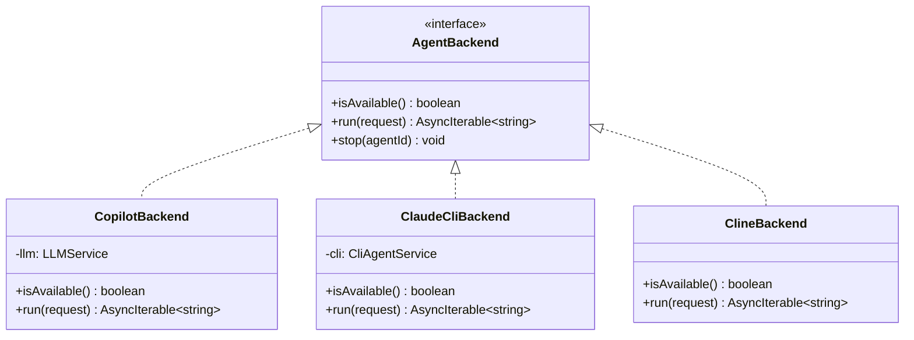

# Extension Host

The Extension Host is the Node.js process that runs inside VS Code. It manages all backend logic including AI agent execution, file persistence, git operations, and workspace scanning.

## Entry Point

The extension activates via `ext/extension.ts`:

```typescript
export function activate(context: vscode.ExtensionContext) {
  const provider = new SidebarProvider(context)
  context.subscriptions.push(
    vscode.window.registerWebviewViewProvider('agent-board.sidebar', provider)
  )
}
```

## WebviewProvider

`WebviewProvider` (`ext/WebviewProvider.ts`) is the central coordinator. It:

1. **Creates the webview** with Content Security Policy and resource URIs
2. **Routes messages** from the webview to appropriate handlers
3. **Manages agent execution** with cancellation support
4. **Handles file I/O** for task persistence and workspace context
5. **Coordinates backends** via `BackendRegistry`

### Key Methods

| Method | Purpose |
|--------|---------|
| `resolveWebviewView()` | Sets up HTML, CSP, message listeners |
| `onMessage()` | Routes 20+ message types to handlers |
| `runAgent()` | Resolves backend, executes agent, streams output |
| `stopAgent()` | Cancels running agent via CancellationToken |
| `buildWorkspaceContext()` | Collects file tree + key files for agent context |
| `scanWorkspaces()` | Discovers git repos from YAML/VS Code settings |

### Agent Caching

Agent configurations are cached in `this.cachedAgents` to avoid reloading on every `runAgent()` call. The cache is invalidated when:

- The user triggers `load-agents` explicitly
- A per-agent backend override is set

## BackendRegistry

The `BackendRegistry` (`ext/AgentBackend.ts`) implements the **Strategy Pattern** for AI backends:



### Resolution Order

1. Per-agent override (if set in agent config)
2. User's default backend (from `board.yaml`)
3. First available backend

If no backend is available, a clear error is thrown.

## GitService

`GitService` (`ext/GitService.ts`) wraps git operations using `execFileSync` to prevent shell injection:

- **Branch management** — create, check existence, get current
- **Staging & commits** — stage files, commit with message
- **Diff & history** — diff stat, recent commits
- **Validation** — branch names and refs validated against regex patterns

## MarkdownStateManager

`MarkdownStateManager` (`ext/MarkdownStateManager.ts`) persists tasks as Markdown files:

```
.tasks/
├── board.yaml          # Board configuration
├── TASK-1-setup-ci.md  # Task file with YAML frontmatter
├── TASK-2-add-auth.md
└── .gitignore
```

Each task file has YAML frontmatter with metadata (stage, priority, assignees) and Markdown body with description and session logs.

## BoardSettings

`BoardSettings` (`ext/BoardSettings.ts`) manages YAML configuration:

```yaml
# .tasks/board.yaml
workspaces:
  - ~/Repos/my-project

agents:
  configPath: ""
  repoPaths:
    - ~/Repos/ai-agents

board:
  name: My Board
  maxTasksPerStage: 10

backends:
  default: copilot-lm
```

The custom YAML parser handles 3-level nesting (sections → sub-sections → values/lists).
