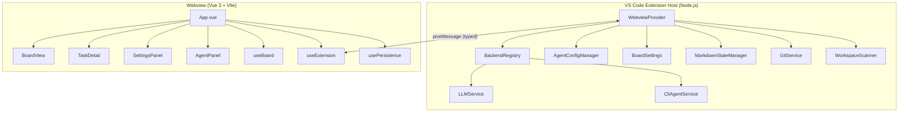
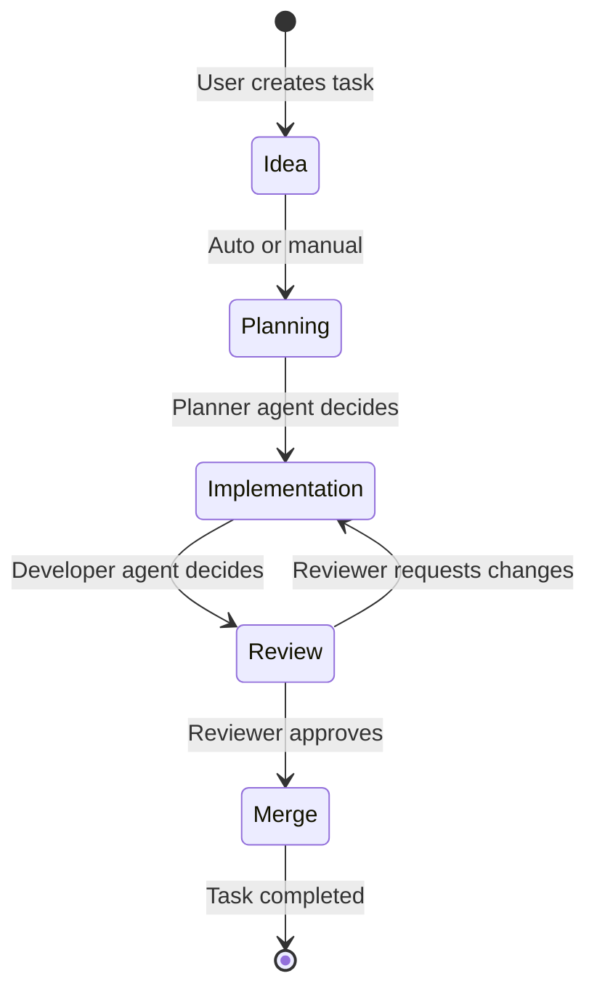
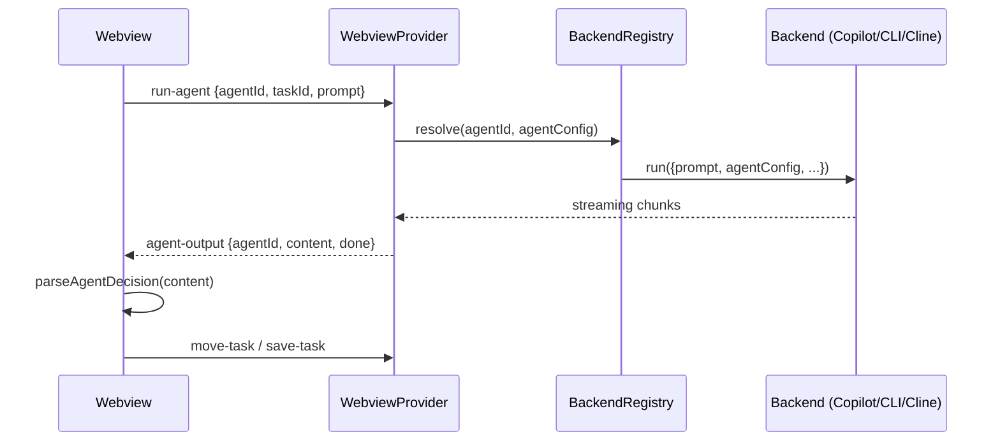

# Architecture Overview

Agent Board follows a **split-process architecture** typical of VS Code extensions: a Node.js Extension Host manages backend logic while a Vue 3 Webview renders the UI. Communication between them uses VS Code's type-safe `postMessage` protocol.

## High-Level Architecture

## Component Responsibilities

### Extension Host (`ext/`)

| Component | File | Responsibility |
|-----------|------|----------------|
| **WebviewProvider** | `WebviewProvider.ts` | Main coordinator — message routing, agent execution, file I/O |
| **BackendRegistry** | `AgentBackend.ts` | Strategy pattern for AI backends (Copilot, CLI, Cline) |
| **AgentConfigManager** | `AgentConfigManager.ts` | Loads agent configs from skills repos, agent.md files |
| **BoardSettings** | `BoardSettings.ts` | YAML-based settings persistence (`board.yaml`) |
| **MarkdownStateManager** | `MarkdownStateManager.ts` | Task persistence as `.md` files with YAML frontmatter |
| **GitService** | `GitService.ts` | Git operations via `execFileSync` with input validation |
| **WorkspaceScanner** | `WorkspaceScanner.ts` | Discovers git repositories in configured paths |
| **LLMService** | `LLMService.ts` | VS Code Language Model API wrapper |
| **CliAgentService** | `CliAgentService.ts` | Claude CLI subprocess management |

### Webview (`src/`)

| Component | File | Responsibility |
|-----------|------|----------------|
| **useBoard** | `composables/useBoard.ts` | Board state management (tasks, stages, transitions) |
| **useExtension** | `composables/useExtension.ts` | postMessage bridge to extension host |
| **usePersistence** | `composables/usePersistence.ts` | Save/load helpers |
| **BoardView** | `components/BoardView.vue` | Kanban board with 5 stage columns |
| **TaskDetail** | `components/TaskDetail.vue` | Task detail overlay with actions |
| **SettingsPanel** | `components/SettingsPanel.vue` | Settings with backend selector |
| **AgentPanel** | `components/AgentPanel.vue` | Per-agent chat interface |

## Data Flow

### Task Lifecycle

### Agent Execution Flow

## Security Model

- **Shell Injection Prevention** — All subprocess calls use `execFileSync` (never `execSync`)
- **Path Traversal Protection** — Resolved paths checked against workspace boundaries (case-insensitive)
- **CSP Nonces** — Cryptographically random nonces for webview Content Security Policy
- **Input Validation** — Git branch names and refs validated before use
- **No eval** — No dynamic code execution
