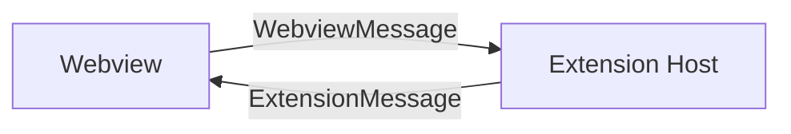

# Message Protocol

The extension host and webview communicate via VS Code's `postMessage` API using a type-safe protocol defined in `ext/protocol.ts`.

## Message Direction



## Webview → Extension Messages (`WebviewMessage`)

Messages sent from the Vue webview to the extension host:

| Type | Payload | Description |
|------|---------|-------------|
| `ready` | — | Webview loaded, request initial data |
| `run-agent` | `agentId, taskId, prompt, sessionMessages?, workspacePath?, branch?` | Start agent execution |
| `stop-agent` | `agentId` | Cancel running agent |
| `save-task` | `task` | Persist task to markdown |
| `delete-task` | `taskId` | Remove task file |
| `load-tasks` | — | Request all persisted tasks |
| `load-agents` | — | Reload agent configurations |
| `scan-workspaces` | — | Discover git repositories |
| `save-settings` | `settings: Partial<BoardSettingsDto>` | Update board settings |
| `set-workspace-paths` | `paths: string[]` | Update workspace paths |
| `set-agent-repo-paths` | `paths: string[]` | Update agent repo paths |
| `detect-backends` | — | Check available AI backends |
| `set-default-backend` | `backendId` | Set default AI backend |
| `set-agent-backend` | `agentId, backendId` | Override backend for specific agent |
| `git-create-branch` | `workspacePath, branchName, taskId` | Create git branch |

## Extension → Webview Messages (`ExtensionMessage`)

Messages sent from the extension host to the Vue webview:

| Type | Payload | Description |
|------|---------|-------------|
| `init` | `InitData` | Initial state (tasks, agents, settings, backends) |
| `agent-output` | `agentId, content, done, taskId?` | Streaming agent response |
| `agent-error` | `agentId, error` | Agent execution error |
| `tasks-loaded` | `tasks[]` | Persisted tasks from disk |
| `agents-loaded` | `agents[]` | Agent configurations |
| `workspaces-updated` | `workspaces[]` | Discovered git repos |
| `settings-updated` | `settings` | Updated board settings |
| `backends-detected` | `backends[]` | Available AI backends |
| `cli-agent-started` | `agentId` | CLI agent process started |
| `cli-agent-done` | `agentId, exitCode, commits` | CLI agent finished |
| `branch-created` | `taskId, branchName, success` | Git branch creation result |
| `toast` | `message, level` | Display toast notification |

## Key Types

### `BackendId`

```typescript
type BackendId = 'copilot-lm' | 'claude-cli' | 'cline'
```

### `BackendInfo`

```typescript
interface BackendInfo {
  id: BackendId
  label: string
  icon: string
  available: boolean
  detail?: string
}
```

### `AgentConfig`

```typescript
interface AgentConfig {
  id: string
  name: string
  role: string
  avatar: string
  color: string
  model: string
  temperature: number
  maxContextTokens: number
  systemPrompt: string
  backend?: BackendId
}
```

### `InitData`

```typescript
interface InitData {
  tasks: Task[]
  agents: AgentConfig[]
  workspaces: WorkspaceInfo[]
  settings: BoardSettingsDto
  backends: BackendInfo[]
  defaultBackend: BackendId
}
```
