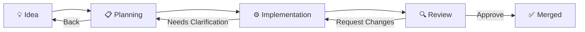

# Task Workflow

Agent Board uses a **configurable state machine** to define how tasks flow through your pipeline. The workflow is fully customizable via `board.yaml` — choose your own stages, transitions, approval gates, and agent mappings.

## Default Workflow (Dev Pipeline)

Out of the box, Agent Board ships with a 5-stage software development pipeline:



| Stage | Icon | Description | Agent Roles |
|-------|------|-------------|-------------|
| **Idea** | 💡 | New ideas, feature requests, bug reports | planner |
| **Planning** | 📋 | Architecture, requirements, task breakdown | planner, architect, developer |
| **Implementation** | ⚙️ | Active development, code writing | developer, devops |
| **Review** | 🔍 | Code review, quality assurance | reviewer |
| **Merged** | ✅ | Completed and merged | — |

## Configuring a Custom Workflow

Add a `workflow` section to your `.tasks/board.yaml`:

```yaml
workflow:
  stages:
    - id: idea
      label: "Idea"
      icon: "💡"
      color: "#f59e0b"
      isFirst: true
    - id: planning
      label: "Planning"
      icon: "📋"
      color: "#8b5cf6"
    - id: implementation
      label: "Implementation"
      icon: "⚙️"
      color: "#3b82f6"
    - id: review
      label: "Review"
      icon: "🔍"
      color: "#f97316"
    - id: merge
      label: "Merged"
      icon: "✅"
      color: "#10b981"
      isFinal: true

  transitions:
    - from: idea
      to: planning
      trigger: both
      label: "Start Planning"
    - from: planning
      to: implementation
      trigger: both
      label: "Begin Implementation"
    - from: implementation
      to: review
      trigger: both
      label: "Submit for Review"
    - from: review
      to: merge
      trigger: human
      requiresApproval: true
      label: "Approve & Merge"
      effects: [set-approved, mark-complete]
    - from: review
      to: implementation
      trigger: both
      label: "Request Changes"
      effects: [reset-approval, reduce-progress]

  agentStageMappings:
    - role: planner
      stages: [idea, planning]
    - role: developer
      stages: [planning, implementation]
    - role: reviewer
      stages: [review]
```

### Stage Properties

| Property | Type | Required | Description |
|----------|------|----------|-------------|
| `id` | string | ✅ | Unique identifier (no spaces, lowercase recommended) |
| `label` | string | ✅ | Display name shown in the board column header |
| `icon` | string | ✅ | Emoji icon shown in the column header |
| `color` | string | ✅ | Hex color for the stage (used in headers and badges) |
| `bgColor` | string | | Background color (rgba recommended) |
| `description` | string | | Tooltip text for the stage column |
| `isFirst` | boolean | | New tasks start in this stage (`+` button shown here) |
| `isFinal` | boolean | | Completed stage — no outgoing transitions expected |

!!! info
    If no stage has `isFirst: true`, the first stage in the list becomes the default. If no stage has `isFinal: true`, the last stage is marked as final automatically.

### Transition Properties

| Property | Type | Required | Description |
|----------|------|----------|-------------|
| `from` | string | ✅ | Source stage ID |
| `to` | string | ✅ | Target stage ID |
| `trigger` | string | ✅ | Who can trigger: `agent`, `human`, or `both` |
| `requiresApproval` | boolean | | If `true`, task is blocked until a human approves |
| `label` | string | ✅ | Button text shown in the task detail panel |
| `effects` | string[] | | Side-effects to apply when this transition fires |

### Transition Effects

Effects are actions automatically applied to a task when a transition fires:

| Effect | Description |
|--------|-------------|
| `set-approval-pending` | Set approval status to "pending", block the task |
| `set-approved` | Set approval status to "approved", unblock the task |
| `mark-complete` | Set progress to 100%, record completion timestamp |
| `reset-approval` | Clear approval status and blocked reason |
| `reduce-progress` | Reduce progress by 20% (minimum 30%) |

### Agent Stage Mappings

Define which agent roles are eligible to work at each stage:

| Property | Type | Required | Description |
|----------|------|----------|-------------|
| `role` | string | ✅ | Agent role name (e.g., `planner`, `developer`, `reviewer`) |
| `stages` | string[] | ✅ | List of stage IDs where this role can operate |
| `promptTemplate` | string | | Custom prompt template (supports `{title}`, `{description}`, `{stage}` placeholders) |

When a task enters a stage, the board automatically triggers agents whose role is mapped to that stage.

## Human-in-the-Loop (HIL) Gates

The `requiresApproval` flag on a transition creates a **Human-in-the-Loop gate**. When a task enters a stage that has an outgoing approval-gated transition:

1. The task is automatically marked as "pending approval"
2. The task shows a **⚠️ Human Approval Required** banner
3. Only human users can approve or reject — agents cannot bypass the gate
4. **Approve** fires the approval transition (with its effects)
5. **Reject** fires the first non-approval backward transition

```yaml
# Example: Review stage requires human approval before merging
transitions:
  - from: review
    to: merge
    trigger: human
    requiresApproval: true
    label: "Approve & Merge"
    effects: [set-approved, mark-complete]
```

## Example: Project Management Workflow

For non-development tasks (e.g., project management, marketing):

```yaml
workflow:
  stages:
    - id: backlog
      label: "Backlog"
      icon: "📥"
      color: "#6b7280"
      isFirst: true
    - id: analysis
      label: "Analysis"
      icon: "🔬"
      color: "#8b5cf6"
    - id: execution
      label: "Execution"
      icon: "🚀"
      color: "#3b82f6"
    - id: qa
      label: "QA"
      icon: "✅"
      color: "#f97316"
    - id: done
      label: "Done"
      icon: "🏁"
      color: "#10b981"
      isFinal: true

  transitions:
    - from: backlog
      to: analysis
      trigger: both
      label: "Analyze"
    - from: analysis
      to: execution
      trigger: both
      label: "Execute"
    - from: execution
      to: qa
      trigger: both
      label: "Submit for QA"
    - from: qa
      to: done
      trigger: human
      requiresApproval: true
      label: "Ship It"
      effects: [mark-complete]
    - from: qa
      to: execution
      trigger: both
      label: "Fix Issues"
      effects: [reset-approval]

  agentStageMappings:
    - role: planner
      stages: [backlog, analysis]
      promptTemplate: "Analyze requirements for: {title}\n\n{description}"
    - role: developer
      stages: [execution]
    - role: reviewer
      stages: [qa]
```

## Example: Simple 3-Stage Workflow

Minimal workflow for quick tasks:

```yaml
workflow:
  stages:
    - id: todo
      label: "To Do"
      icon: "📝"
      color: "#3b82f6"
      isFirst: true
    - id: doing
      label: "In Progress"
      icon: "🔄"
      color: "#f59e0b"
    - id: done
      label: "Done"
      icon: "✅"
      color: "#10b981"
      isFinal: true

  transitions:
    - from: todo
      to: doing
      trigger: both
      label: "Start"
    - from: doing
      to: done
      trigger: both
      label: "Complete"
      effects: [mark-complete]
    - from: doing
      to: todo
      trigger: human
      label: "Back to To Do"
```

## Autonomous Flow

When agents are active, the workflow runs autonomously:

1. **Task Created** → Placed in the first stage (`isFirst: true`)
2. **Agent Triggered** → Based on `agentStageMappings`, the appropriate agent starts work
3. **Agent Decision** → The agent outputs a structured `DECISION` block
4. **Transition Fires** → Task moves to the next stage, effects are applied
5. **HIL Gate** → If the transition requires approval, the task pauses for human review
6. **Loop** → Steps 2–5 repeat until the task reaches a final stage

### Decision Protocol

Agents communicate decisions through structured output:

```
DECISION: approve
NEXT_STAGE: merge
COMMENTS: All tests pass. Code follows project conventions. Ready to merge.
```

### Feedback Loops

When a reviewer requests changes, the task moves backward with feedback attached. The developer agent addresses each issue and resubmits:

```
DECISION: request_changes
NEXT_STAGE: implementation
COMMENTS:
- Missing error handling in the API endpoint
- Test coverage is below 80%
```

## Manual Overrides

Users can always manually control the workflow:

- **Drag & Drop** — Move tasks between columns in the board view
- **Action Buttons** — Use transition buttons in the task detail panel
- **Run Agent** — Manually trigger specific agents at any stage
- **Approve/Reject** — Control HIL gates directly

## Session History

Each agent interaction is logged as a **session** on the task, including messages, timestamps, agent identity, and decision outcomes. Sessions are persisted in the task's Markdown file under `## Sessions`.
