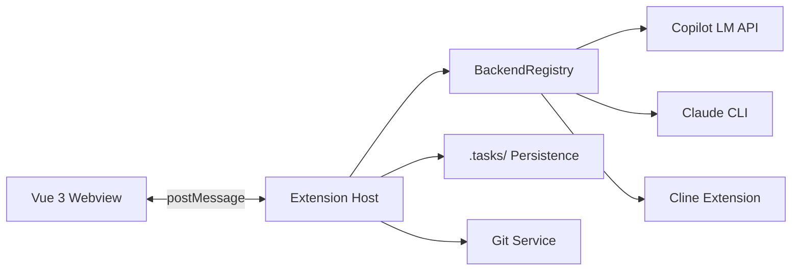

# Agent Board

**AI-powered kanban board for VS Code with autonomous agent workflows.**

Agent Board is a VS Code extension that provides a visual kanban board where AI agents autonomously plan, implement, review, and merge code changes. Tasks flow through five stages — from initial idea to merged code — with AI agents handling the heavy lifting at each step.

## Key Features

- **5-Stage Kanban** — Idea → Planning → Implementation → Review → Merge
- **Multi-Backend AI** — GitHub Copilot, Claude CLI, or Cline
- **Autonomous Workflow** — Agents move tasks through stages automatically
- **Multi-Agent Architecture** — Planner, Developer, and Reviewer agents collaborate
- **Persistent State** — Tasks stored as Markdown files with YAML frontmatter
- **Configurable** — YAML-based settings, pluggable agent skills

## Quick Start

```bash
# Clone and install
git clone https://github.com/stefanposs/agent-board.git
cd agent-board
npm install

# Build
npm run build:all

# Install in VS Code
cp -r dist/ ~/.vscode/extensions/stefanposs.agent-board-0.1.0/dist/
```

Then open VS Code and use the **Agent Board** sidebar panel.

## Architecture at a Glance



## Documentation

| Section | Description |
|---------|-------------|
| [Architecture](architecture/overview.md) | System design, components, data flow |
| [Setup](setup/installation.md) | Installation and configuration |
| [Guides](guides/agents.md) | Agent configuration, backends, workflows |
| [Development](development/getting-started.md) | Contributing, testing, building |
| [API Reference](api/protocol.md) | Protocol types and domain model |
