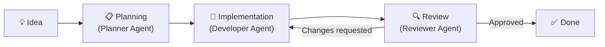
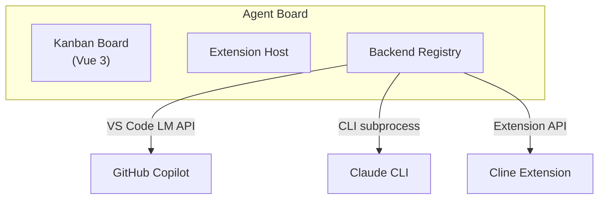

# Why Agent Board?

## The Problem

Modern AI-assisted development workflows rely on:

- **Chat-based copilots** — powerful but stateless, you drive every step manually
- **Terminal-based agents** — run once, no visibility into progress, no persistent task tracking
- **Issue trackers + manual handoff** — context lost between planning, implementation, and review
- **Multiple disconnected tools** — switch between IDE, browser, terminal, and chat for every task

None of these give you a **visual, persistent board** where AI agents autonomously move tasks from idea to merged code — all inside your editor.

---

## What Makes Agent Board Different

| Capability | Agent Board | Chat Copilot | Terminal Agents | Issue Trackers |
|---|---|---|---|---|
| **Visual task board** | :material-check: Kanban in VS Code | :material-close: | :material-close: | :material-check: Browser only |
| **Autonomous workflow** | :material-check: Agents drive stages | :material-close: Manual prompts | :material-check: Single run | :material-close: |
| **Multi-agent collaboration** | :material-check: Planner + Developer + Reviewer | :material-close: | :material-close: | :material-close: |
| **Multi-backend support** | :material-check: Copilot, Claude, Cline | Single provider | Single provider | N/A |
| **Persistent state** | :material-check: Markdown + YAML | :material-close: Session only | :material-close: | :material-check: |
| **Configurable workflow** | :material-check: YAML-defined stages | :material-close: | :material-close: | :material-check: |
| **Code review loop** | :material-check: Built-in agent review | :material-close: | :material-close: | Separate tool |
| **Lives in the IDE** | :material-check: VS Code native | :material-check: | Terminal | Browser |
| **Setup time** | ~2 minutes | Built-in | Varies | N/A |
| **Cost** | Free (open-source, MIT) | Subscription | Varies | Varies |

---

## Deep Dive: Autonomous Workflow — From Idea to Merged Code

With chat copilots, **you** are the orchestrator — copy-pasting context, deciding what to do next, manually triggering each step.

With Agent Board, you **describe the task** and agents handle the rest:

1. Drop a task into the board
2. A **Planner agent** breaks it into implementation steps
3. A **Developer agent** writes the code
4. A **Reviewer agent** checks quality and requests changes
5. Approved tasks are ready to merge

All transitions happen automatically based on agent decisions, with full visibility on the kanban board.



### What Makes It Unique

1. **Visual progress** — see every task's status at a glance on the kanban board
2. **Agent decisions** — agents parse structured decisions (approve, request changes, needs clarification) and act on them
3. **Feedback loops** — reviewers can send tasks back with specific feedback; developers iterate automatically
4. **Configurable stages** — define your own workflow in `board.yaml` — add QA, staging, or any custom stage
5. **Persistent state** — every task is a Markdown file in `.tasks/` with YAML frontmatter, version-controlled alongside your code
6. **Multi-backend** — swap between Copilot, Claude CLI, or Cline without changing your workflow

---

## Deep Dive: Multi-Backend Architecture — Your Agent, Your Choice

Most AI tools lock you into a single provider. Agent Board is **backend-agnostic** by design.

### Three Backends, One Workflow



| Backend | Best For | How It Works |
|---------|---------|---------|
| **GitHub Copilot** | Zero-config, already installed | Uses VS Code Language Model API directly |
| **Claude CLI** | Power users, long-context tasks | Spawns `claude` as a subprocess with structured output |
| **Cline** | Custom prompts, existing Cline workflows | Communicates via the Cline extension API |

Switch backends per task or globally — the workflow stays the same.

!!! success "The Bottom Line"
    Agent Board doesn't force a provider choice. Use Copilot for quick tasks,
    Claude for complex refactors, and Cline for specialized workflows — all
    from the same board.

[**Backend Selection Guide →**](guides/backends.md){ .md-button }

---

## Deep Dive: Configurable Workflow — Your Process, Your Stages

Default workflows won't fit every team. Agent Board lets you define your own pipeline in `board.yaml`:

```yaml
workflow:
  stages:
    - id: backlog
      label: Backlog
    - id: design
      label: Design Review
    - id: implementation
      label: Implementation
    - id: qa
      label: QA Testing
    - id: staging
      label: Staging
    - id: done
      label: Done

  transitions:
    - from: backlog
      to: design
      label: Start Design
    - from: design
      to: implementation
      label: Approved
    - from: implementation
      to: qa
      label: Submit for QA
    - from: qa
      to: staging
      label: QA Passed
      effects: [notify]
    - from: qa
      to: implementation
      label: QA Failed
    - from: staging
      to: done
      label: Ship It
      effects: [notify, archive]
```

**5 minutes** to match your team's process — not weeks of tool customisation.

[**Workflow Configuration Guide →**](guides/workflow.md){ .md-button }

---

## Ideal Use Cases

<div class="grid" markdown>

<div class="card" markdown>
### :material-account-group: Solo Developers
Let agents handle the boring parts — planning, boilerplate, code review — while you focus on architecture and creative decisions.
</div>

<div class="card" markdown>
### :material-source-branch: Feature Development
Describe a feature, watch agents plan, implement, and review it. Iterate via the feedback loop until quality matches your standards.
</div>

<div class="card" markdown>
### :material-bug: Bug Fixing
Drop a bug report on the board. Agents analyse the issue, propose a fix, implement it, and self-review before you merge.
</div>

<div class="card" markdown>
### :material-school: Learning & Exploration
Use the board to explore unfamiliar codebases. Agents explain, refactor, and document — with every step visible on the board.
</div>

</div>

---

## What You Get Out of the Box

1. **Kanban board** — drag-and-drop tasks across configurable stages, all inside VS Code
2. **Multi-agent orchestration** — Planner, Developer, and Reviewer agents collaborate automatically
3. **Three AI backends** — GitHub Copilot, Claude CLI, Cline — switch anytime
4. **Persistent tasks** — Markdown files with YAML frontmatter in `.tasks/`, version-controlled
5. **Configurable workflow** — define stages, transitions, and effects in `board.yaml`
6. **Agent feedback loops** — structured decisions drive automatic transitions and iterations
7. **Comment threads** — discuss tasks with agents and team members
8. **Git integration** — workspace scanning, branch awareness, diff context
9. **YAML settings** — board-level configuration without touching code
10. **Full type safety** — TypeScript throughout, shared protocol types between host and webview

---

## Open Source & Extensible

Agent Board is licensed under [MIT](https://github.com/stefanposs/agent-board/blob/main/LICENSE). You can:

- Define custom workflows that match your team's process
- Switch between AI backends depending on the task
- Extend the agent configuration with custom skills and prompts
- Fork, modify, and self-host with zero restrictions

!!! tip "Getting Started"
    Ready to try it? Follow the [Installation Guide](setup/installation.md) to have
    Agent Board running in under 2 minutes.

[**Get Started →**](setup/installation.md){ .md-button .md-button--primary }
[**View Architecture →**](architecture/overview.md){ .md-button }
